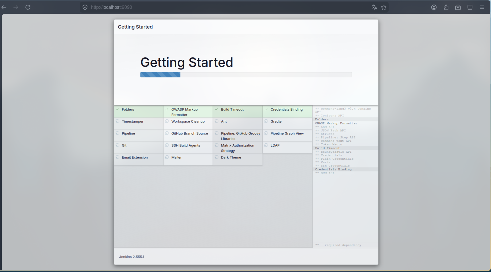
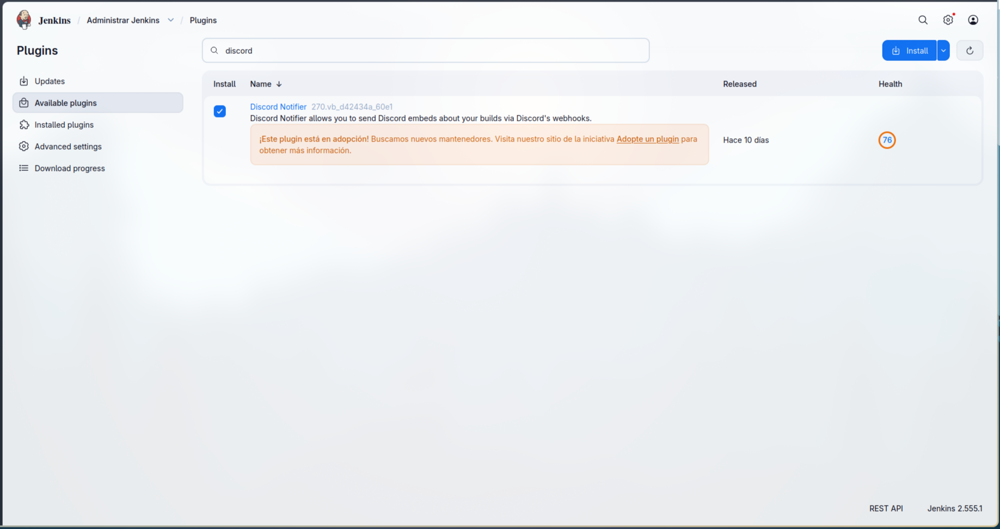
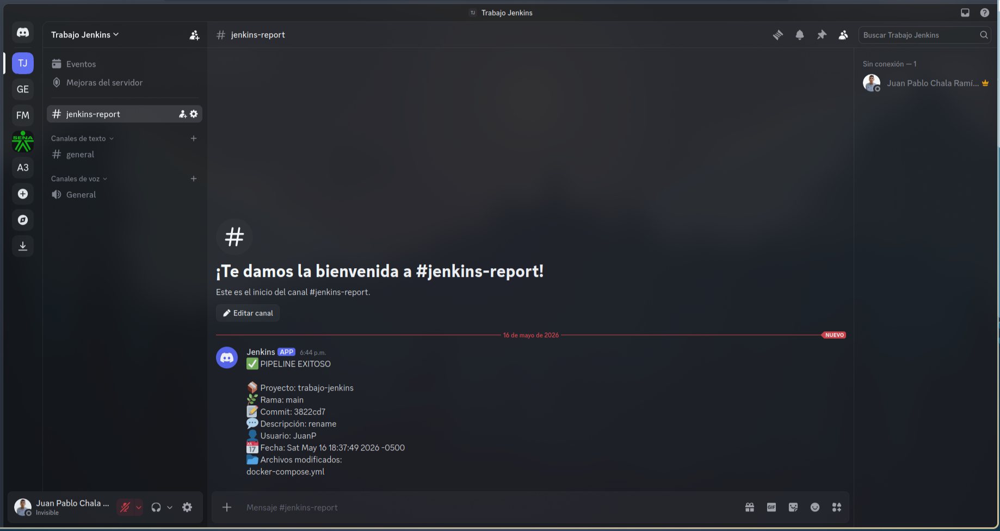

# Jenkins

En esta actividad se realizó la implementación de un entorno de integración continua utilizando Jenkins y Docker, permitiendo automatizar procesos de validación y pruebas de proyectos de software.

Se configuraron Jobs tipo Pipeline para ejecutar verificaciones automáticas sobre un proyecto desarrollado con un framework de desarrollo web, integrando GitHub para la activación automática mediante Webhooks y configurando notificaciones vía correo electrónico y Discord.

### Docker

Esta es una configuracion base de Jenkins, mediante un gestion por docker compose.

#### docker-compose.yml

```yml
services:
    jenkins:
        container_name: jenkins-container
        image: jenkins/jenkins:2.555.1-lts-jdk25
        restart: unless-stopped
        user: root
        ports:
            - 9090:8080
            - 50000:50000
        volumes:
            - jenkins_home:/var/jenkins_home
            - /var/run/docker.sock:/var/run/docker.sock

volumes:
jenkins_home:
```

### Pipeline

```pipeline
pipeline {

    agent any

    environment {
        DISCORD_WEBHOOK = 'https://discord.com/api/webhooks/1505306840840405097/NWfTBhFl-kTtM-FugxexifsEu5vssELfe1mCSN5PjEBGbXzjJbXbISQNyixkuICxjhYi'
    }

    stages {

        stage('Clonar repositorio') {
            steps {
                git branch: 'main',
                    url: 'https://github.com/Juan-Chala-123/tech-solutions-s-a-s.git'
            }
        }

        stage('Build') {
            steps {
                echo 'Construcción completada'
            }
        }

        stage('Deploy') {
            steps {
                echo 'Deploy exitoso'
            }
        }
    }

    post {

        success {

            script {

                def commitId = sh(
                    script: 'git rev-parse --short HEAD',
                    returnStdout: true
                ).trim()

                def commitMessage = sh(
                    script: 'git log -1 --pretty=%B',
                    returnStdout: true
                ).trim()

                def author = sh(
                    script: 'git log -1 --pretty=%an',
                    returnStdout: true
                ).trim()

                def date = sh(
                    script: 'git log -1 --pretty=%cd',
                    returnStdout: true
                ).trim()

                def files = sh(
                    script: 'git diff-tree --no-commit-id --name-only -r HEAD',
                    returnStdout: true
                ).trim()

                writeFile file: 'discord.json', text: """
{
  "content": "✅ PIPELINE EXITOSO\\n\\n📦 Proyecto: ${env.JOB_NAME}\\n🌿 Rama: main\\n📝 Commit: ${commitId}\\n💬 Descripción: ${commitMessage}\\n👤 Usuario: ${author}\\n📅 Fecha: ${date}\\n📂 Archivos modificados:\\n${files}"
}
"""

                sh '''
                    curl -H "Content-Type: application/json" \
                    -X POST \
                    -d @discord.json \
                    $DISCORD_WEBHOOK
                '''
                
                emailext(
                    to: 'juanpablochalaramirez@gmail.com',
                    subject: "✅ Pipeline exitoso - ${env.JOB_NAME}",
                    body: """
                    <h2>Pipeline ejecutado correctamente</h2>

                    <p><b>Proyecto:</b> ${env.JOB_NAME}</p>
                    <p><b>Rama:</b> main</p>
                    <p><b>Commit:</b> ${commitId}</p>
                    <p><b>Descripción:</b> ${commitMessage}</p>
                    <p><b>Usuario:</b> ${author}</p>
                    <p><b>Fecha:</b> ${date}</p>

                    <p><b>Archivos modificados:</b></p>

                    <pre>
${files}
                    </pre>
                    """,
                    mimeType: 'text/html'
                )
            }
        }

        failure {

            sh '''
                curl -H "Content-Type: application/json" \
                -X POST \
                -d "{\"content\":\"❌ PIPELINE FALLÓ\"}" \
                $DISCORD_WEBHOOK
            '''
        }
    }
}
```

### Evidencias

#### Instalación de Plugin



#### Instalacion de Discord Notifier



#### Notificacion a un servidor de Discord

