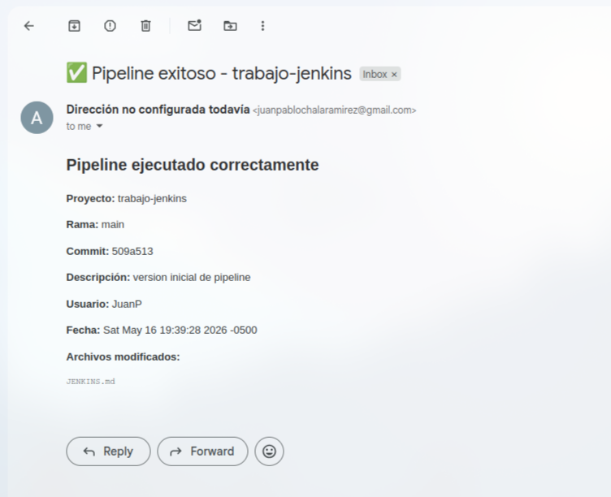
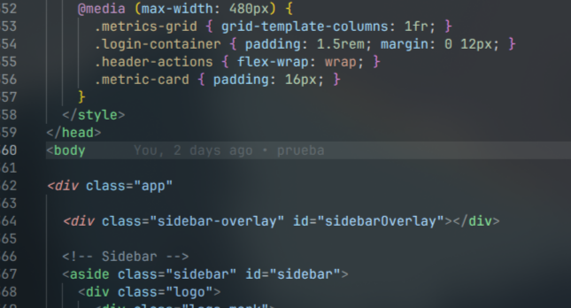
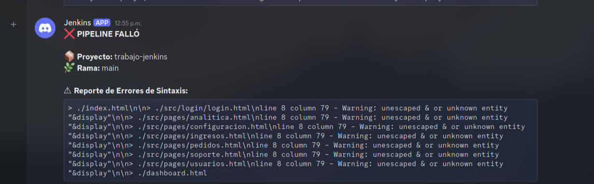
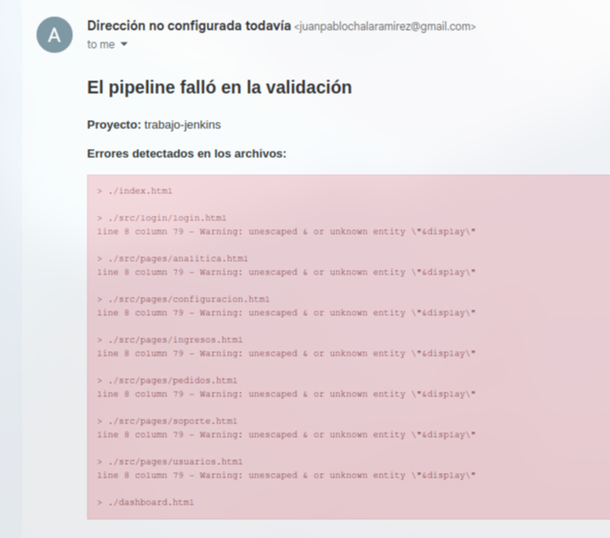
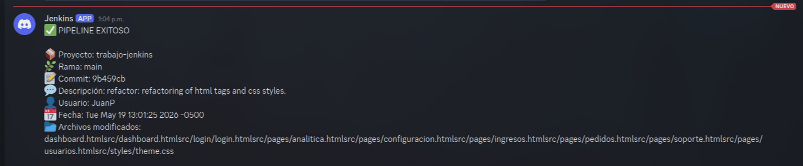
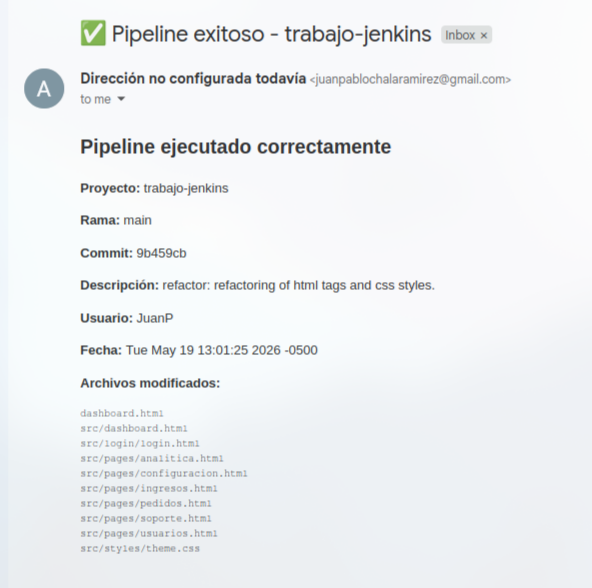

# Jenkins

En esta actividad se realizó la implementación de un entorno de integración continua utilizando Jenkins y Docker, permitiendo automatizar procesos de validación y pruebas de proyectos de software.

Se configuraron Jobs tipo Pipeline para ejecutar verificaciones automáticas sobre un proyecto desarrollado con un framework de desarrollo web, integrando GitHub para la activación automática mediante Webhooks y configurando notificaciones vía correo electrónico y Discord.

### Docker

Esta es una configuracion base de Jenkins, mediante un gestion por docker compose.

#### docker-compose.yml

```yml
services:
    jenkins:
        container_name: jenkins-container
        image: jenkins/jenkins:2.555.1-lts-jdk25
        restart: unless-stopped
        user: root
        ports:
            - 9090:8080
            - 50000:50000
        volumes:
            - jenkins_home:/var/jenkins_home
            - /var/run/docker.sock:/var/run/docker.sock

volumes:
jenkins_home:
```

### Pipeline

```groovy
pipeline {

    agent any

    environment {
        DISCORD_WEBHOOK = 'https://discord.com/api/webhooks/1505306840840405097/NWfTBhFl-kTtM-FugxexifsEu5vssELfe1mCSN5PjEBGbXzjJbXbISQNyixkuICxjhYi'
    }
    

    stages {

        // Clona automáticamente el repositorio desde GitHub
        stage('Clonar repositorio') {
            steps {
                git branch: 'main',
                    url: 'https://github.com/Juan-Chala-123/tech-solutions-s-a-s.git'
            }
        }
        
        // Instala tidy en el agente
        stage('Instalar herramientas') {
            steps {
                sh '''
                    apt-get update
                    apt-get install -y tidy
                '''
            }
        }

        /*
        Valida:
        - etiquetas HTML
        - estructura
        - errores de sintaxis
        */
        stage('Validar HTML') {
            steps {
                script {

                    def archivos = sh(
                        script: 'find . -name "*.html"',
                        returnStdout: true
                    ).trim()

                    if (!archivos) {
                        error("No se encontraron archivos HTML")
                    }

                    def salidaTidy = sh(
                        script: '''
                            find . -name "*.html" | while read file; do
                                echo "> $file"
                                tidy -qe "$file" 2>&1
                                echo ""
                            done || true
                        ''',
                        returnStdout: true
                    ).trim()

                    env.HTML_ERRORS = salidaTidy

                    if (salidaTidy.contains("Warning") || salidaTidy.contains("Error")) {
                        echo "❌ Se encontraron errores HTML"
                        error("Errores HTML detectados:\\n${salidaTidy}")
                    } else {
                        echo "✅ HTML válido"
                    }
                }
            }
        }
        
        // Aqui fingimos validar css, pero realmente no
        stage('Validar CSS') {
            steps {
                sh 'echo "Validación CSS básica OK"'
            }
        }

        // Aqui simulamos 
        stage('Build') {
            steps {
                echo 'Construcción completada'
            }
        }

        stage('Deploy') {
            steps {
                echo 'Deploy exitoso'
            }
        }
    }

    // Notificamos por medio de discord y gmail
    post {
        // Si esta bien, mostramos el commit, los archivos modificados, el respoensable, etc...
        success {
            script {

                def commitId = sh(
                    script: 'git rev-parse --short HEAD',
                    returnStdout: true
                ).trim()

                def commitMessage = sh(
                    script: 'git log -1 --pretty=%B',
                    returnStdout: true
                ).trim()

                def author = sh(
                    script: 'git log -1 --pretty=%an',
                    returnStdout: true
                ).trim()

                def date = sh(
                    script: 'git log -1 --pretty=%cd',
                    returnStdout: true
                ).trim()

                def files = sh(
                    script: 'git diff-tree --no-commit-id --name-only -r HEAD',
                    returnStdout: true
                ).trim()

                writeFile file: 'discord.json', text: """
{
  "content": "✅ PIPELINE EXITOSO\\n\\n📦 Proyecto: ${env.JOB_NAME}\\n🌿 Rama: main\\n📝 Commit: ${commitId}\\n💬 Descripción: ${commitMessage}\\n👤 Usuario: ${author}\\n📅 Fecha: ${date}\\n📂 Archivos modificados:\\n${files}"
}
"""

                sh '''
                    curl -H "Content-Type: application/json" \
                    -X POST \
                    -d @discord.json \
                    $DISCORD_WEBHOOK
                '''
                
                emailext(
                    to: 'juanpablochalaramirez@gmail.com',
                    subject: "✅ Pipeline exitoso - ${env.JOB_NAME}",
                    body: """
                    <h2>Pipeline ejecutado correctamente</h2>

                    <p><b>Proyecto:</b> ${env.JOB_NAME}</p>
                    <p><b>Rama:</b> main</p>
                    <p><b>Commit:</b> ${commitId}</p>
                    <p><b>Descripción:</b> ${commitMessage}</p>
                    <p><b>Usuario:</b> ${author}</p>
                    <p><b>Fecha:</b> ${date}</p>

                    <p><b>Archivos modificados:</b></p>

                    <pre>
${files}
                    </pre>
                    """,
                    mimeType: 'text/html'
                )
            }
        }

        failure {
            // Si esta encuentra errores, por ejemplo en HTML, detecta en que lineas las encontro y ls muestra.
            script {
                // Obtenemos los errores directamente de la variable de entorno que guardamos en el stage
                def errorLog = env.HTML_ERRORS ? env.HTML_ERRORS : "Error desconocido (revisa los logs generales de Jenkins)."
                
                // Sanitizamos para el JSON de Discord
                errorLog = errorLog.replace('\\', '\\\\').replace('"', '\\"').replace('\r', '').replace('\n', '\\\\n')

                if (errorLog.length() > 1200) {
                    errorLog = errorLog.take(1200) + "\\\\n... [Log truncado por espacio] ..."
                }
                
                writeFile file: 'discord-error.json', text: """
{
  "content": "❌ **PIPELINE FALLÓ**\\n\\n📦 **Proyecto:** ${env.JOB_NAME}\\n🌿 **Rama:** main\\n\\n⚠ **Reporte de Errores de Sintaxis:**\\n```\\n${errorLog}\\n```"
}
"""
                
                sh '''
                    curl -H "Content-Type: application/json" \
                    -X POST \
                    -d @discord-error.json \
                    $DISCORD_WEBHOOK
                '''

                emailext(
                    to: 'juanpablochalaramirez@gmail.com',
                    subject: "❌ Pipeline falló - ${env.JOB_NAME}",
                    body: """
                    <h2>El pipeline falló en la validación</h2>
                    <p><b>Proyecto:</b> ${env.JOB_NAME}</p>
                    <p><b>Errores detectados en los archivos:</b></p>
                    <pre style="background-color: #f8d7da; color: #721c24; padding: 10px; border: 1px solid #f5c6cb;">${errorLog.replace('\\\\n', '<br>')}</pre>
                    """,
                    mimeType: 'text/html'
                )
            }
        }
    }
}
```

### Evidencias

#### Instalación de Plugin


#### Instalacion de Discord Notifier


#### Notificación a un servidor de Discord


#### Notificación a un correo electrónico



#### Notificar errores



#### Discord y Gmail





#### Solucionando los errors



